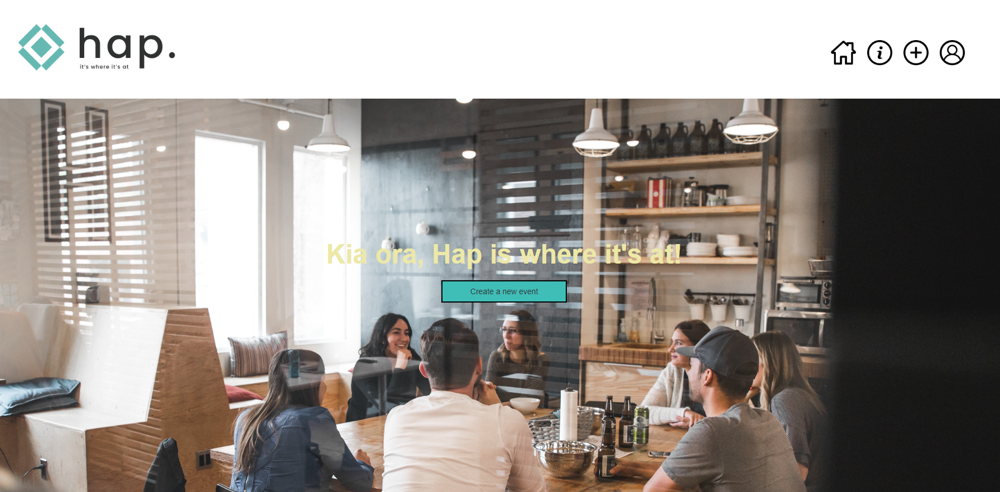

<!--Input from Keegan, Justina and Thomas-->
# Project Name
> Our task was to build a sharing app for an event management organisation
> Live demo [_here_](https://www.example.com). <!-- If you have the project hosted somewhere, include the link here. -->

## Table of Contents
* [General Info](#general-information)
* [Technologies Used](#technologies-used)
* [Features](#features)
* [Screenshots](#screenshots)
* [Setup](#setup)
* [Usage](#usage)
* [Project Status](#project-status)
* [Room for Improvement](#room-for-improvement)
* [Acknowledgements](#acknowledgements)
* [Contact](#contact)
<!-- * [License](#license) -->

## General Information
- The app was created by Justina Ho, Keegan Dufty and Thomas King. We are 3 young and eager web designers and developers studying WUX at Yoobee Colleges.
- What problem does it (intend to) solve? The app was created as a sharing app solution does not exist and speakers are unable to connect with their audiences.
- What is the purpose of your project? The purpose of the app is to allow guest anbd speakers to share information about events
- Why did you undertake it? We undertook the project as we believed we could create an environment that would benefit the parties mentioned previously. 
<!-- You don't have to answer all the questions - just the ones relevant to your project. -->

## Technologies Used
- Vue JS
- Axios
- Vue CLI

## Features
List the ready features here:
- Login/Logoff
- Create post (share text)
- Profile page
- About information

## Screenshots

<!-- If you have screenshots you'd like to share, include them here. -->

## Setup
What are the project requirements/dependencies? Where are they listed? A requirements.txt or a Pipfile.lock file perhaps? Where is it located?
This project is created using Vue JS 3
This requires the Vue CLI and Vue router to be installed to use.

Proceed to describe how to install / setup one's local environment / get started with the project.

The project requires AXIOS to serve as an API. The NPM is needed along with Axios to access data.
To access the *DB* the user will also need to install the following packages:
- npm install json-server
- npx json-server --watch data/db.json 

## Usage
How does one go about using it?
One goes to the login page (/login). After entering their details (user: user, password: user) the user arrives on the home page. They can select a post to read it or choose to create a new post to add an event to the list. 

`write-your-code-here`

## Project Status
Project is: 
The project is on track for completion. We aim to have the MVP ready for submission by 6pm on Sunday the 25th of September. 

## Room for Improvement
There are many areas where this app could be improved.

Room for improvement:
- The ability for users to have more effective filtering options in the search area
- The ability to login using a social network login
- Users could have the ability to have avatars that appear across the website and people can engage more directly between members
- The ability to have a profile area where users could customse their settings (i.e. dark mode, changing font size and colour, background colour etc)

Here is a list of TODO features we would like to integrate in the future. 
To do:
- The ability for the users to upload images and videos
- The ability to chat interactively with other Hap app users
- The integration of a follow button to allow users to send friend requests and to connect with other users
- Improved search bar functionality
- Integrations to more effectively improve and enable private communication and the pushing of notifications
- Creating an open functioning forum
- Improving the the performance and delivery of real time notifications
- Improving the customizable privacy settings and security of the ap app

## Acknowledgements
Give credit here.
- This project could not have been built without the tireless work of Justina Ho, Keegan Dufty, and Thomas King
- We would like to that Stackoverflow, MDN docs, and the team at Vue for all the resources we used to build this project
- Many thanks to Miguel Cruz too for his mentorship and knowledge
- A special thanks to our moms too and the people that supported us during the development of this app. 

## Contact
Created by Justina Ho, Keegan Dufty, and Thomas King [@theteam](https://www.<givemeaname>.co.nz/) - feel free to contact us!

<!-- Optional -->
## License -->
This project is open source and available to all keen users wanting to mix and to mingle.

